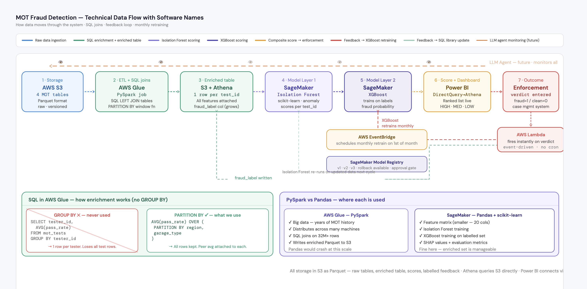
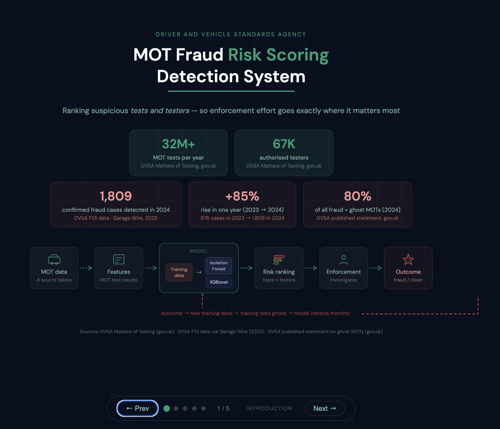
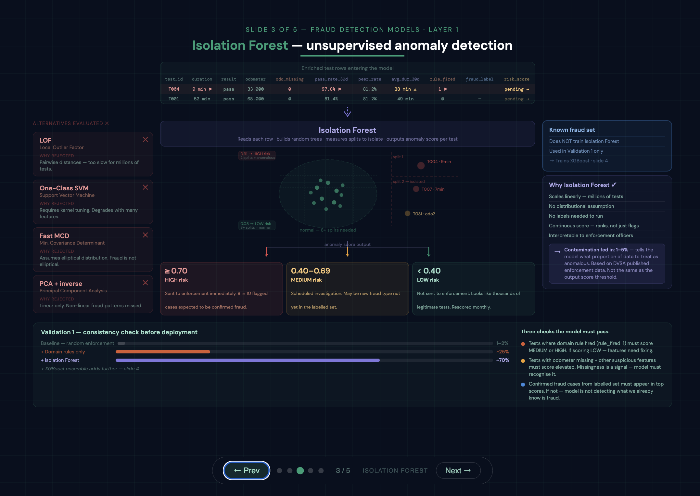
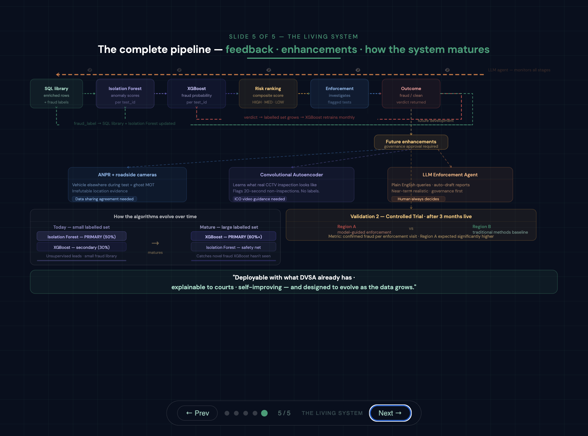

# 🚗 MOT Fraud Risk Scoring System

An end-to-end machine learning fraud detection architecture designed to identify suspicious MOT tests and testers using anomaly detection, supervised learning, behavioural analytics, and continuous feedback retraining.

This project simulates how a national-scale MOT fraud detection platform could operate using real-world data science, MLOps, and cloud engineering principles.

---

# 📌 Project Objectives

The system was designed to:

- Detect potentially fraudulent MOT tests
- Rank suspicious testers and garages by risk
- Reduce enforcement investigation time
- Combine unsupervised + supervised ML approaches
- Continuously improve as new confirmed fraud cases are discovered
- Demonstrate production-scale architecture thinking beyond notebook-only modelling

---

# 🧠 Core Machine Learning Strategy

The project intentionally uses a two-layer fraud detection approach.

## Phase 1 — Early System (Small Labelled Fraud Dataset)

Initially, confirmed fraud labels are limited.

Therefore:

- Isolation Forest acts as the PRIMARY model
- XGBoost acts as a SECONDARY supervised enhancer
- The system focuses on detecting anomalous behavioural patterns

This allows the platform to discover fraud even when little historical fraud data exists.

---

## Phase 2 — Mature System (Large Labelled Fraud Library)

As enforcement teams confirm fraud cases:

- Fraud labels grow monthly
- XGBoost retrains on increasingly richer labelled data
- XGBoost gradually becomes the PRIMARY model
- Isolation Forest becomes the SAFETY NET model

At maturity:

| Model | Role |
|---|---|
| XGBoost | Main fraud probability engine |
| Isolation Forest | Detects novel unseen fraud patterns |

This mirrors how real enterprise fraud platforms evolve over time.

---

# 🏗️ End-to-End Technical Workflow

---

# 📊 System Presentation Slides

---

## 1️⃣ Platform Overview

### Highlights
- National-scale MOT fraud context
- Risk ranking pipeline
- Enforcement feedback loop
- Continuous retraining architecture

---

## 2️⃣ Data Foundation & SQL Enrichment

### Key Data Science Concepts
- SQL LEFT JOIN enrichment
- Window functions
- Peer-group behavioural features
- Fraud rule engineering
- Missingness as signal
- Unit-of-analysis design

### Technologies
- SQL
- AWS Glue
- PySpark
- Athena
- S3

---

## 3️⃣ Isolation Forest — Unsupervised Detection

### Why Isolation Forest
- No labels required
- Scales to millions of tests
- Detects unusual tester behaviour
- Effective during early fraud-library stages

### Alternative Models Evaluated
- LOF
- One-Class SVM
- Fast MCD
- PCA + inverse reconstruction

### Key Features Engineered
- Test duration
- Tester pass-rate deviation
- Missing odometer behaviour
- Retest frequency
- Peer-group comparisons

---

## 4️⃣ XGBoost — Supervised Fraud Probability Layer

### Why XGBoost
- Learns confirmed fraud patterns
- Handles non-linear feature interactions
- Produces explainable feature importance
- Strong tabular-data performance

### Composite Risk Score

The final risk score combines:

- Isolation Forest anomaly score
- XGBoost fraud probability
- Domain-rule activation

This creates:
- HIGH risk
- MEDIUM risk
- LOW risk prioritisation

### Explainability

The system is intentionally designed to remain:

- Explainable to investigators
- Auditable
- Court-defensible
- Operationally interpretable

---

## 5️⃣ Continuous Learning & Feedback Loop

### Continuous Improvement Architecture

As enforcement confirms fraud:

1. Verdict returns into fraud library
2. SQL enriched dataset updates
3. XGBoost retrains monthly
4. Fraud detection accuracy improves
5. Isolation Forest continues catching unseen fraud types

This creates a living fraud detection ecosystem rather than a static model.

---

# ☁️ Cloud & Engineering Stack

| Area | Technology |
|---|---|
| Storage | AWS S3 |
| ETL | AWS Glue |
| Distributed Processing | PySpark |
| Query Engine | Athena |
| ML Platform | SageMaker |
| Unsupervised ML | Isolation Forest |
| Supervised ML | XGBoost |
| Scheduling | AWS EventBridge |
| Event Processing | AWS Lambda |
| Dashboarding | Power BI |
| Analysis | Python + Pandas |
| Feature Engineering | SQL |

---

# 🧪 Data Science Techniques Demonstrated

## Feature Engineering
- Rolling averages
- Peer-group comparisons
- Behavioural aggregation
- Fraud-rule features
- Window functions
- Missingness indicators

---

## Machine Learning
- Unsupervised anomaly detection
- Supervised classification
- Ensemble scoring
- Composite risk modelling
- Threshold optimisation

---

## Validation Strategy
- Time-aware validation
- Fraud-library growth simulation
- Controlled enforcement trial design
- Operational evaluation metrics

---

# 🔒 Governance & Responsible AI

The project incorporates:

- GDPR-aware processing
- Data minimisation principles
- Human-in-the-loop enforcement
- Explainable ML outputs
- Auditability considerations

No personal identifiers are required for model scoring.

---

# 📈 Future Enhancements

Potential future extensions include:

- ANPR roadside camera integration
- CCTV-based inspection analysis
- Autoencoder video anomaly detection
- LLM-assisted enforcement reporting
- Real-time fraud streaming pipelines
- Graph-based fraud network analysis

---

# 🎯 What This Project Demonstrates

This project was built to demonstrate:

✅ End-to-end machine learning system design  
✅ Real-world fraud analytics thinking  
✅ Production-scale architecture awareness  
✅ Advanced feature engineering  
✅ MLOps lifecycle understanding  
✅ Cloud-native data science concepts  
✅ Explainable AI design principles  
✅ Operational deployment thinking  

---

# 👩‍💻 Author

Victoria Moreno Sempere

Data Science | Machine Learning | Fraud Analytics | Healthcare & Public Sector AI
