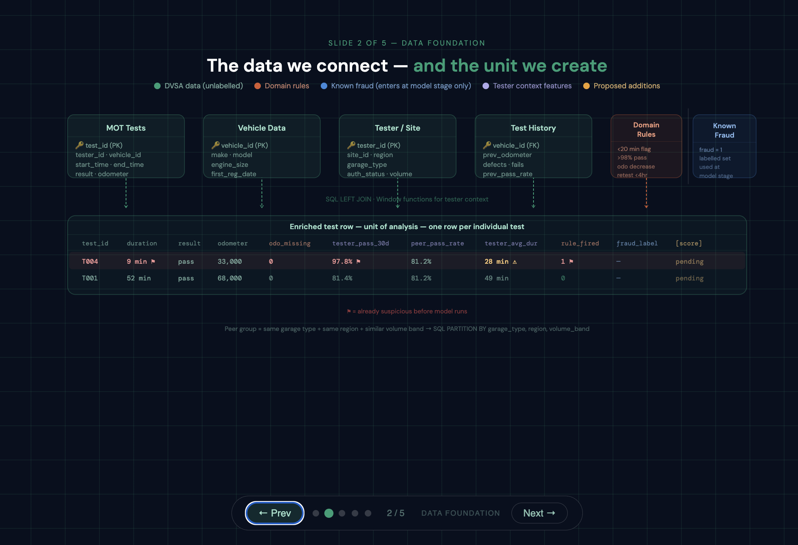
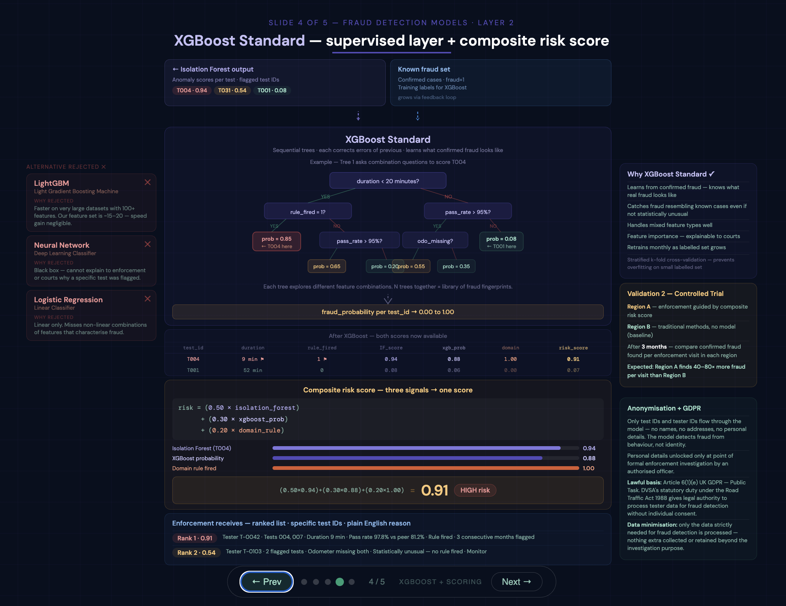

# 🚗 MOT Fraud Detection Risk Scoring System

> Hybrid machine learning architecture for operational fraud detection using anomaly detection, supervised learning, behavioural analytics, explainable AI, and continuous feedback loops.

--- 
 
# 📌 Project Objective

This project demonstrates a conceptual end-to-end fraud detection system designed to support MOT enforcement operations at scale.

The objective is NOT to automatically declare fraud.

Instead, the system:

✔ identifies suspicious behavioural patterns  
✔ ranks high-risk tests and testers  
✔ supports enforcement decision-making  
✔ improves continuously through feedback loops  
✔ detects both known and previously unseen fraud behaviours  

---

# 🚨 The Operational Problem

DVSA publicly reported:

- **32M+ MOT tests annually**
- **67K authorised testers**
- **1,809 confirmed fraud cases in 2024**
- **85% increase in confirmed fraud within one year**
- approximately **80% linked to “ghost MOTs”**

At this scale, manual enforcement alone cannot efficiently identify suspicious behaviour patterns across the national MOT network.

This project explores how machine learning and risk modelling could support targeted operational enforcement.

---

# 🖼️ System Overview


---

# 🧠 Hybrid Detection Strategy

The system combines three complementary layers.

---

## 🔹 Layer 1 — Isolation Forest (Unsupervised)

The first layer uses Isolation Forest anomaly detection.

This model:

- requires no fraud labels
- learns patterns of “normal” behaviour
- isolates statistically unusual behaviour
- detects potentially hidden or novel fraud patterns

Examples:
- unusually short MOT durations
- abnormal pass rates
- suspicious retest timing
- odometer inconsistencies
- unusual peer-group deviation

---

## 🔹 Layer 2 — XGBoost (Supervised)

The second layer uses XGBoost supervised learning.

This layer learns from:
- confirmed fraud cases
- enforcement outcomes
- previously investigated patterns

XGBoost identifies:
- combinations of suspicious features
- known fraud signatures
- repeated behavioural fingerprints

---

## 🔹 Layer 3 — Composite Risk Scoring

All detection signals combine into one operational score.

Example inputs:
- Isolation Forest anomaly score
- XGBoost fraud probability
- rule-based fraud triggers

The output:
- ranked investigation queue
- low / medium / high risk categorisation
- explainable enforcement reasoning

---

# 📊 Data Foundation & Engineering

The system integrates multiple operational datasets.



---

## Connected datasets

### MOT Test Data
- test IDs
- tester IDs
- vehicle IDs
- timestamps
- pass/fail outcomes
- odometer readings

### Vehicle Data
- registration year
- make/model
- engine size

### Tester & Site Data
- garage
- tester history
- site volume
- regional information

### Historical Test Behaviour
- previous failures
- prior pass rates
- defect history
- mileage progression

### Confirmed Fraud Cases
- known enforcement outcomes
- labelled fraud investigations
- validated suspicious behaviour

---

# 🏗️ Data Engineering Concepts

The pipeline demonstrates:

✔ SQL joins  
✔ LEFT JOIN logic  
✔ window functions  
✔ behavioural aggregation  
✔ rolling contextual statistics  
✔ missingness handling  
✔ feature engineering  
✔ anomaly feature construction  

---

# 🔍 Isolation Forest — Behavioural Anomaly Detection


---

## Why Isolation Forest?

Isolation Forest was selected because it:

✔ scales efficiently across millions of records  
✔ does not require labelled fraud data  
✔ makes no distributional assumptions  
✔ handles complex anomaly patterns  
✔ produces continuous anomaly scores  
✔ detects previously unseen fraud behaviour  

---

## Alternatives evaluated

The project also evaluates and rejects:

### ❌ Local Outlier Factor (LOF)
Too computationally expensive at large scale.

### ❌ One-Class SVM
Requires difficult kernel tuning and scales poorly.

### ❌ Fast Minimum Covariance Determinant (Fast MCD)
Assumes elliptical statistical distributions.

### ❌ PCA-based anomaly detection
Captures mainly linear relationships.

---

# 🤖 XGBoost — Supervised Fraud Layer



---

## Why supervised learning is added later

A critical challenge in fraud detection:

> absence of a fraud label does NOT mean absence of fraud

Most fraud remains hidden.

Therefore:
- fully supervised learning alone is insufficient
- anomaly detection must lead initially

However, DVSA provides a small set of confirmed fraud cases.

This allows:
- validation of anomaly scores
- threshold calibration
- supervised refinement
- operational benchmarking

---

## Why XGBoost?

XGBoost was selected because it:

✔ handles tabular data extremely well  
✔ captures non-linear fraud interactions  
✔ handles mixed feature types  
✔ provides feature importance scores  
✔ supports explainability requirements  
✔ performs strongly with moderate feature sets  

---

## Why not neural networks?

Deep learning approaches were considered but deprioritised because:

- enforcement decisions require transparency
- courts require explainability
- labelled fraud data is initially limited
- operational interpretability is critical

---

# 📈 Composite Risk Scoring

The system combines multiple signals into one operational score.

Example:

```python
risk_score =
    (0.50 * isolation_forest_score) +
    (0.30 * xgboost_probability) +
    (0.20 * domain_rule_score)
```

---

## Risk categorisation

| Risk Score | Operational Category |
|---|---|
| 0.00 – 0.39 | Low Risk |
| 0.40 – 0.69 | Medium Risk |
| 0.70 – 1.00 | High Risk |

---

## Explainable outputs

Each investigation flag includes:

- specific test ID
- contributing features
- anomaly explanation
- rule triggers
- fraud probability
- peer-group comparison

This supports:
- operational trust
- enforcement usability
- auditability
- explainability in court settings

---

# 🔁 Continuous Learning System


---

# 🧬 Model Evolution Over Time

The system is intentionally designed to evolve as the labelled fraud library grows.

---

## 📍 Early-stage deployment

At deployment, confirmed fraud labels are limited.

Therefore:

- Isolation Forest acts as the primary detection engine
- unsupervised anomaly detection performs most of the heavy lifting
- XGBoost plays a secondary validation role using the small confirmed fraud set

This allows detection of:

✔ hidden fraud  
✔ statistically unusual behaviour  
✔ previously unseen fraud patterns  

---

## 📍 Mature deployment

As enforcement investigations confirm more fraud cases:

- the labelled fraud library expands
- XGBoost becomes increasingly powerful
- supervised learning gradually becomes dominant

At this stage:

- XGBoost learns nuanced fraud fingerprints
- Isolation Forest transitions into a safety-net role
- anomaly detection scans for completely novel fraud patterns

This creates a continuously improving hybrid detection architecture.

---

# 🔄 Feedback Loop Architecture

Every confirmed investigation outcome feeds back into the system.

This enables:

✔ retraining  
✔ recalibration  
✔ threshold optimisation  
✔ fraud library growth  
✔ adaptation to evolving fraud methods  

The longer the system operates, the more intelligent and operationally effective it becomes.

---

# ☁️ Cloud & Deployment Concepts

This project conceptually references:

- AWS SageMaker
- EventBridge scheduling
- SQL data warehousing
- automated retraining pipelines
- cloud-based analytical workflows

---

# 🧾 Governance & Responsible AI

The system is designed with public-sector governance principles in mind.

---

## GDPR & Privacy

The analytical pipeline uses:
- anonymised identifiers
- pseudonymised records
- data minimisation principles

No personal identities are required for model scoring.

---

## Human-in-the-loop enforcement

The system supports decision-making.

It does NOT replace investigators.

Final fraud determinations remain entirely human-led.

---

## Explainability

The architecture prioritises:
- transparent scoring
- interpretable outputs
- feature-level reasoning
- auditability

This is essential for:
- operational trust
- regulatory compliance
- enforcement evidence standards

---

# 🚀 Potential Future Enhancements

Future developments could include:

### 📷 ANPR Integration
Automatic Number Plate Recognition for ghost MOT validation.

### 🎥 Convolutional Autoencoders
CCTV inspection anomaly detection.

### 🤖 LLM Enforcement Assistant
Natural-language querying and investigation summarisation.

### 📊 SHAP Explainability
Advanced feature contribution analysis.

### 🔄 Active Learning Pipelines
Investigator feedback-driven retraining optimisation.

---

# 🛠️ Technical Stack

## Languages & Libraries
- Python
- SQL
- Pandas
- NumPy
- Scikit-learn
- XGBoost

## Machine Learning
- Isolation Forest
- supervised classification
- anomaly detection
- ensemble scoring
- behavioural analytics

## Engineering Concepts
- feature engineering
- relational joins
- cloud architecture
- automated retraining
- risk scoring pipelines

---

# ⚠️ Disclaimer

This repository is a conceptual and educational portfolio project.

No confidential DVSA systems, operational datasets, or sensitive internal information are included.

---

# 👩‍💻 Author

Victoria Moreno Sempere

Data Science • Machine Learning • Risk Modelling • Operational Analytics • AI Systems
